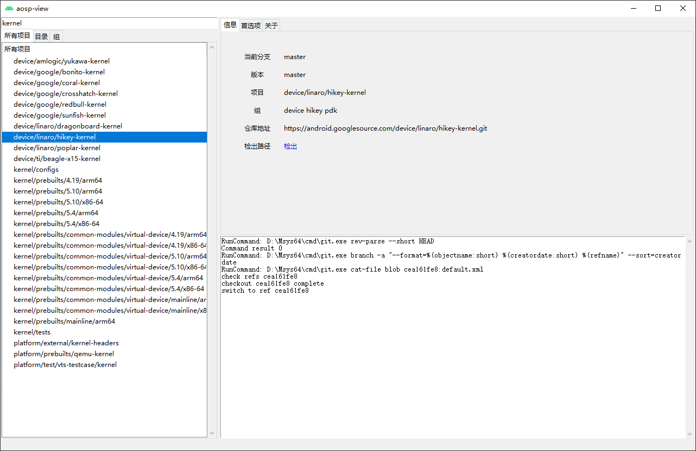

# aosp-view 


* 浏览 [AOSP](https://android.googlesource.com)
* 检出项目
* 快速根据项目名搜索子项目

## 需求

- Python 3.x
- Git


需要安装 `git` ，并且可以在环境变量访问，也可以打开软件后设定`git`的位置


## 安装 & 运行

### Windows

方法一： 从[release](https://github.com/LaoQi/aosp-view/) 下载直接运行(通过`PyInstaller`打包)


方法二: 下载源码，手工运行
```shell
python main.py
```

## 截图

